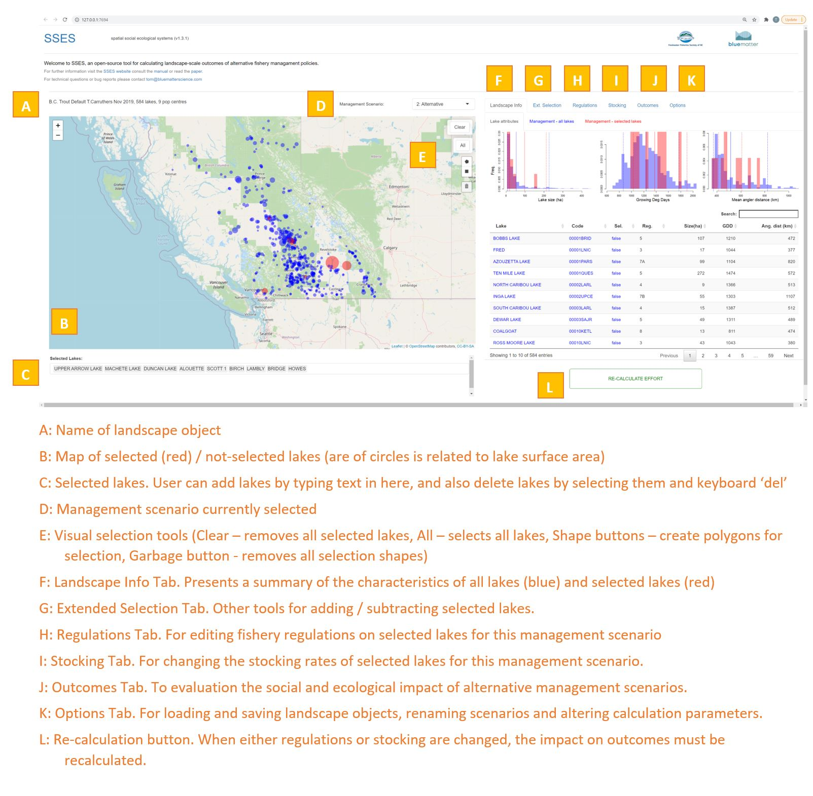

<style type="text/css">

h4{ /* Normal  */
   font-size: 13px;
}
body{ /* Normal  */
   font-size: 12px;
}
td {  /* Table  */
   font-size: 8px;
}
h1 { /* Header 1 */
 font-size: 18px;
 color:  #00783A;
}
h2 { /* Header 2 */
 font-size: 15px;
 color: #00783A;
}
h3 { /* Header 3 */
 font-size: 15px;
 color: #00783A;
}
code.r{ /* Code block */
  font-size: 10px;
}
pre { /* Code block */
  font-size: 10px
}
</style>


 \

<br>


```{r set options, echo = FALSE}

knitr::opts_chunk$set(collapse = TRUE, comment = "#>")
knitr::opts_chunk$set(dpi=85)
options(width = 650)

library(SSES)

```

<br>

# About SSES

SSES is an R package (blue-matter/SSES) that contains code for specifying and running a landscape-scale social ecosystems model [Carruthers et al. 2019](https://cdnsciencepub.com/doi/10.1139/cjfas-2018-0168). The package contains in-line help for specifying landscape models and running analyses. The model is also presented in an SSES Shiny App that is available both locally (is included the R package) and online. 

The default landscape object is described in Carruthers et al. (2019) and is for the BC Trout fishery that includes 584 stocked lakes and 9 population centres (each with four angler classes), six stocking types and 4 management regulations. Here is the abstract of that paper:

The first relatively complete landscape-scale social–ecological system (SES) model of a recreational fishery was developed and ground-truthed with independent angling effort data. Based on the British Columbia multistock recreational fishery for rainbow trout (Oncorynchus mykiss), the model includes hundreds of individual lake fisheries, hundreds of thousands of anglers, originating from tens of communities, connected by complex road and trail networks, all distributed over a landscape of approximately half a million square kilometres. The approach is unique in that it incorporates realistic and empirically derived behavioural interactions within and among the three key components of the SES: angler communities, fish populations, and management policies. Current management policies were characterized and alternate policies assessed by simulation. We examined spatial patterns in ecological and social properties of the SES and used simulations to investigate the impacts of alternate management policies on these patterns. Simulation outcomes strongly depended on the spatial redistribution of anglers across the landscape, existing road networks, heterogeneity in angler behaviours, and the spatial pattern of fish
population productivity.

# Purpose of this document.

This document:

* Provides a brief background to Spatial Social-Ecological Systems (SSES) modelling
* Describes the default BC Trout lakes example. 
* Provides guidance on installing the SSES R package and running the SSES Shiny App locally and online
* Explains how to use the SSES Shiny App

# Quick Start

To take a quick first look at the SSES App follow this [link](http://142.103.48.20:3838/SSES/)


Figure 1. A screenshot from the SSES Shiny App. 

# Changes for v1.4.1

* App includes new outcome tables by lake
* Various changes to App to improve clarity of presentation

# Introduction

## Social Ecological Systems Models

Spatially structured consumer–resource systems exhibit complex and hierarchical dynamics that may be interpreted under the metapopulation paradigm (Wu and Loucks 1995; Hanski 1999;Sanchirico and Wilen 2005). This complexity and spatial hierarchy is particularly evident at the intersection of management, governance, and natural systems (i.e., social–ecological systems (SESs; Cash et al. 2006; Liu et al. 2007; Levin et al. 2013; McGinnis and Ostrom 2014; Arlinghaus et al. 2017). Obtaining accurate SES predictions can be difficult because consumers are mobile, resources are patchy, and the dynamics of the holistic system depends on the behaviour of many interdependent parts;  this includes heterogeneous behaviour of humans (Liu et al. 2007) and metapopulation dynamics among a patchy resource landscape (Sanchirico and Wilen 2005). Despite these difficulties, SESs require a mechanistic understanding of the processes driving system dynamics to advise natural resource decision-making.

Theoretical frameworks have been developed that formally link bioeconomic, landscape, metapopulation, and social–ecological processes (Sanchirico and Wilen 1999, 2005; Ostrom 2009; Folke et al. 2010) to inform management of SESs. Such theory has guided development of models to predict patterns in resource exploitation based on a mechanistic understanding of human, ecological,and abiotic behaviour (Fulton et al. 2011; Cenek and Franklin
2017). Application of such mechanistic models has occurred frequently for marine fisheries but is less common in freshwater recreational fisheries (see, e.g., Post et al. 2008; Hunt et al. 2011).

SES models contain ecological, social, and management (governance) components, which are linked by behavioural feedbacks (Ostrom 2009). Both terrestrial and aquatic SESs can be spatially structured and spatially managed (Synes et al. 2016). Hence, any SES model must explicitly capture the key processes that regulate these feedbacks and, as in any spatially complex system, also make credible predictions across space and time (Carpenter and
Brock 2004; Sanchirico and Wilen 2005; Synes et al. 2016). Similarly to terrestrial environments, freshwater fisheries typically exhibit discrete spatial patchiness. While the population dynamics of freshwater and marine fisheries are similar (e.g., growth, reproduction, survival), both consumer behaviour (e.g., angler behaviour, preferences, and associated effort responses) and fish populations are generally easier to observe in freshwater fisheries than marine fisheries, which often operate offshore and over much larger geographic ranges. It follows that SESs for freshwater fisheries offer a bridge between marine and terrestrial case studies. Lastly, and of interest to many spatial ecologists, the dispersal processes in many inland fisheries are asymmetrical, as the consumers (anglers) are comparatively more mobile than the resource (i.e., recreational anglers travel long distances, while inland fishes are often precluded from large migrations).


Figure 2. The management, biological and  components of the landscape-scale SSES model. 

It is increasingly recognised that managing recreational fisheries should consider the wider SES accounting for the complex interdependence among management measures, angler preference, fish population dynamics, and the spatial distribution of anglers in relation to angling opportunities (Radomski et al. 2001;Post et al. 2008; Johnston et al. 2010; Hunt et al. 2011; Lester et al. 2014). The potential benefits of doing so include more appropriate
measures of management performance (Carpenter and Brock 2004) and improved prediction of system responses to management measures (Cox et al. 2003; Beardmore et al. 2011; Arlinghaus et al. 2017). While previous SES models have included components for biological and human dimensions, these have produced only simulated predictions of spatial angler effort and catch rates, for example (Sanchirico and Wilen 1999, 2005; Post et al. 2008; Fulton
et al. 2011; Hunt et al. 2011). Two primary obstacles in creating defensible, empirically derived SES models include the high data requirements (e.g., surveying anglers, lake monitoring of angling effort) and efficient computation of the predicted state of the system for a proposed management option (Synes et al. 2016). The
latter is required to allow the SES model to be run iteratively when fitted to data but is challenging because recreational systems often include thousands of lakes and hundreds of thousands of anglers (e.g., Post et al. 2008; Hunt et al. 2011).


## The BC Rainbow Trout SSES 

Rainbow trout provide an important multistock recreational fishery to inland British Columbia, a landscape of  approximately 500 000 km2 that includes over 4000 lakes, of which nearly 600 are stocked annually with hatchery-raised wild-strain rainbow trout (Fig. 1). This fishery landscape is highly connected with a complex road and trail network and hundreds of population centres. The recreational fishery is managed by the British Columbia
provincial government and attracts about 2.5 million angler-days per year (DFO 2010) worth an estimated value of approximately US$800 million per year (Bailey and Sumaila 2012). The primary management objectives as articulated by the British Columbia provincial government are to “conserve wild fish and their habitats” and to “optimize recreational opportunities based on the fishery resource”. Measures of success associated with these objectives include angler satisfaction, fishing effort, and license sales (MOE 2007).


Figure 3. The BC landscape of lakes and population centres. 

Travel distance is one of the primary factors influencing fishing effort (Post et al. 2008). The road network in British Columbia is convoluted, and there are multiple routes that can be taken from each population center to each fishing site. Least travel time distance was calculated among the centroids of lakes and population centres along paved, gravel, and foot paths with spatial data extracted from the Digital Road Atlas of the British Columbia
Geographic Warehouse (http://www2.gov.bc.ca/gov/content/data/geographic-data-services/bc-spatial-data-infrastructure/bc-geographicwarehouse). 

Least travel time for larger lakes was calculated for each access point, rather than the centroid of the lake, and the closest access point was used for travel time calculations. A range of management options are available for managing the British Columbia recreational trout fishery, including size, number and species of stocked fish, fishing regulations (e.g., bag limits, boat engine restrictions), amenities (e.g., boat ramps, toilets, campsites), and access (e.g., footpaths, trails, paved roads). 

Currently, management decisions for British Columbia trout lakes are made primarily at the level of individual lakes, and therefore these ignore a body of research on the ecology and angler behaviour that suggests that management decisions, ecological processes, and human behaviour are interdependent over the wider landscape scale (Cox et al. 2003; Carpenter and Brock 2004; Fenichel et al. 2013). For example, increasing the stocking rate of
a particular lake may draw anglers away from other lakes due to higher expected catch rates (Post et al. 2008; Post and Parkinson 2012; Mee et al. 2016). An increase in angler density may also dissuade certain classes of anglers that now exploit opportunities at other lakes (Dabrowska et al. 2014, 2017). Because angler classes have varying fishing efficiencies (Ward et al. 2013b), catch rates, and therefore exploitation levels, may be altered across a wider set of lakes. These changes in exploitation level may lead to changes in the growth rate and size composition of fish in these lakes (Walters and Post 1993; Askey et al. 2013; Ward et al. 2013b) and alter attractiveness for some angler classes (Aas et al. 2000).

Because various classes of angler are not distributed evenly across British Columbia (e.g., casual anglers are most predominant in the urban centres of southern British Columbia; Dabrowska et al.2014), improving angling opportunities in any given lake is likely to have an uneven benefit across angler classes. In this hypothetical scenario, a single management action has important wider consequences for both angling pressure over a wider range of lakes and equality of opportunity among anglers.

## The landscape model in SSES

The SSES available in the R package and App is a novel landscape-scale spatial SES model that brings
together extensive research into the human dimensions of British Columbia trout anglers (Dabrowska et al. 2014, 2017) with lakespecific biological models of harvest compensation through density-dependent growth (Walters and Post 1993; Parkinson et al. 2004; Askey et al. 2013; Lester et al. 2014; Ward et al. 2017). The model was validated with detailed angling effort data gathered from whole-lake management experiments (Mee et al. 2016) and it has been demonstated that it can be used to inform management policy across a diverse range of management options and performance metrics.

The S-SES has three principal components to capture the processes that characterize the behavioural feedbacks and nodes of a generalized SES relevant to this and many other recreational fisheries:

1. an angler behaviour model that predicts the amount of angler effort on multiple lakes for multiple angler classes residing in multiple population centres;

2.  a biological model that predicts the impact of stocking rate options and fishing mortality rate on survival and growth of fish in each lake; and

3. a numerical approach for converging on a stable distribution of angling effort over the landscape.

For more information about the model see [Carruthers et al. 2019](https://cdnsciencepub.com/doi/10.1139/cjfas-2018-0168)


# Accessing the App

## Online

SSES is freely available [online](http://142.103.48.20:3838/SSES/). 

## Offline

You can also run the App locally on your computer. To do so install the R package and use the SLICK() function:

```{r offline, eval=F}
library(devtools)
install_github("blue-matter/SSES")
library(SSES)
Shiny("SSES")
```


# Using the App

The process for using the App follows the steps:

* Step 1. Select lakes (Ext. Selection tab)

* Step 2. Change management (Regulations and/or Stocking tabs)

* Step 3. Recalculate landscape effort (Recalculation button)

* Step 4. Compare outcomes (Outcomes)

* Step 5. Create a new management scenario (Options), 

* Repeat steps 1-5 for a new management scenario and so on. 

Selection occurs on the left-hand side and is facilitated by a navigable map. Specification of alternative management scenarios, graphing of outputs etc is carried out using the tabs on the right-hand side of the App:



Figure 4. The layout of the SSES Shiny App. 

## Landscape Info Tab

Information about the entire landscape of lakes and those that have been selected is available in the Lake Info Tab. Lakes have characteristics that are not manageable in the App such as lake size and productivity (i.e. growing degree days). These non-management characteristics are described in the Lake attributes sub-tab. Management attributes (stocking rates and regulations) that may differ among management scenarios are illustrated in the 'Management-all lakes' and 'Management - selected lakes' sub tabs. 

### Lake attributes

Frequency charts and an interactive data table provide a basis for understanding how non-management lake attributes vary among all of the lakes and those that may have been selected. 


### Management - all lakes & Management - selected lakes

Here, a series of frequency diagrams show how management options (stocking rates and regulations) differ among the various management scenarios. 


## Extended Selection Tab

In addition to selecting lakes using the map and polygons, users can select lakes grouped by their attributes. 


## Regulations Tab

The regulations tab contains various options for specifying alternative management scenarios.

### Edit Regulations by Individual Lake

These tools allow users to edit the data-table directly, altering specific regulations for particular lakes. 


### Edit Regulations by Selected Lakes

Alternatively users can change regulations for the group of lakes that have been selected. 


## Stocking Tab

Along with regulations, the second way in which management scenarios can differ is by stock rate for the various types and sizes of stocked trout. 

Six stocking types are modelled in the B.C. trout lakes landscape:

```{r Stocking types, eval=T, echo=F,width=300}
stock<-data.frame(Abbreviation = c("t2NCA","t3NCA","t2NFR","t3NFR","t2NYE","t3NYE"),
                  Description = c("Diploid catchable",
                                  "Triploid catchable",
                                  "Diploid fry",
                                  "Triploid fry",
                                  "Diploid yearling",
                                  "Triploid yearling"
                                  ))
DT::datatable(stock,width = '35%',rownames=F, options=list(dom='t'))
```

### Edit Stocking by Individual Lake

The stocking data table can be edited directly to provide lake-scale control of stocking options


### Edit Stocking by Selected Lakes

Alternatively stocking for one or more fish types can be applied to all selected lakes.  


## Outcomes Tab

Once altnerative management scenarios have been specified the predicted effort distribution can be calculated. The expected outcomes of these management scenarios are presented in the Outcomes Tab. 

### Outcomes for All lakes / Selected lakes

This sub-tab provide a top-level graphical depiction of effort and cost changes across all lakes and selected lakes. 


### Outcome Comparisons  

To better reveal differences from status quo or a reference management scenario, the Comparisons sub-tab provides deltas in effort and costs. 


### Lake specific outcomes

New to version 1.4x is a series of downloadable tables of outcomes on a lake by lake basis. 


### Convergence in outcomes

The numerical algorithm that approximates the ideal free distribution of angling effort is iterative and converges on a stable distribution (see Equation 20 and Figure 5 of the SSES paper). 

The App provides a simple top-level graphical diagnostic of convergence. This is the change in lake-specific effort as the algorithm progresses. This should be close to zero by the maximum iteration from which outcomes are summarized. The definition of 'close' is case and user specific but generally if all lakes are within half an angler day, that is unlikely to strongly alter conclusions.  


## Options Tab

The options Tab provides tools for loading and saving landscape objects, creating and naming management scenarios and altering parameters of the numerical approximation approach used to calculate the ideal free distribution of effort. 


  
# Troubleshooting

## Shiny App features overlap or are not clickable

The SSES App will function on low resolution monitors but, due to interacting with a high resolution map, works best on 1080p monitors or preferably higher. As with all HTML webpages, if you run into issues with the layout, try zooming in/out using ctrl-mouse wheel or ctrl +/-.

## Lakes are not selecting

Are you sure you have 'Add' selected in the Ext. Selection Tab so that you are in fact adding lakes to your selection (I've done this numerous times)?

## Getting further help

Please feel free to email tom@bluematterscience.com for help or to submit requests and bug reports. 


# Acknowledgements

This work was funded by the [Freshwater Fisheries Society of British Columbia](www.gofishbc.com).

The modelling work and data that underpin the B.C. trout lakes landscape model is a product of a wide-ranging collaboration between the FFSBC, the B.C. Ministry of the Environment, the University of Calgary and the University of British Columbia (see authors of Carruthers et al. 2019 below). 

Many thanks to the feedback of Brett van Poorten, Russel Bobrowski, Nikolaus Gantner (and the class of Biol414).

# References

Carruthers, T.R., Dabrowska, K., Haider, W., Parkinson, E., Varkey, D., Ward, H., McAllister, M. K., Godin T., Van Poorten, B., Askey, P., Wilson, K.L., Hunt, L.M., Clark, A., Newton, E., Walters, C.J., Post, J.R. 2019. Landscape-scale social and ecological outcomes of dynamic angler and fish behaviours: processes, data and patterns. Can. J. Fish. Aquat, Sci. 76: 970-988. [dx.doi.org/10.1139/cjfas-2018-0168](https://cdnsciencepub.com/doi/10.1139/cjfas-2018-0168)


# Glossary

```{r Glossary, eval=T, echo=F}
gloss<-data.frame(Abbreviation = c("GDD","IFD","SSES"),
                  Description = c("Growing Degree Days. A measure of lake productivity: the total number of degrees x days that the lake is at a temperature conducive to fish growth",
                    "Ideal Free Distribution. The theoretical distribution of effort where there are no marginal benefits to a change in effort                                           distribution",
                                  "Spatial Social Ecological Systems model. A model that combines management, human and ecological systems components across a spatially explicit landscape"))
DT::datatable(gloss,rownames=F, options=list(dom='t'))
```


